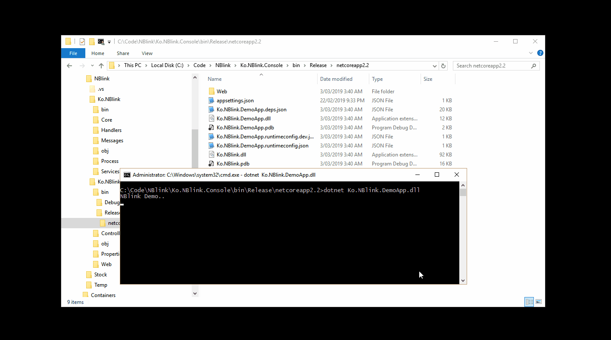

## NBlink
Chrome based desktop GUI for .net core(2.2) applications

NBLink is .net core library build to interact with chrome web browser using Chrome DevTools Protocol (limited set). NBlink can be used to build Cross platform HTML5 based Desktop applications using .net core as backend. NBlink uses current deployed instance of chrome instead of embedded version so its light weight.

Uses tip-of-the-tree (tot) version of Chrome DevTools Protocol so any version above 70 will work 

#Features
- Dot net core (2.2) based library 
- Call .net methods from JavaScript
- Execute JavaScript code from .net methods   
- Inbuilt server to serve html and other static resources
- loads data URL’s, internal and external URL’s

#Roadmap
- More Chrome DevTools Protocol coverage 
- MACOS and Linux versions

Demo application included in visual studio solution will help you to get started

